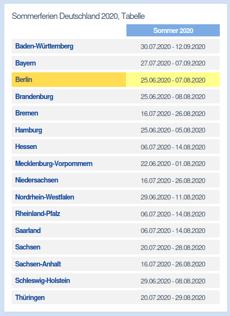

## Driving Question {background-image="img/COVIDtimes_3.jpg"}

- **Did summer breaks like school vacation *increase* or *decrease* the COVID-19 pandemic?**
- Focus on Germany 2020-2022

Idea: School summer breaks differ in Germany by federal state (16 state). This allows to compare the development of trends in states with and without summer breaks at a given time.

::: aside
I made a nice background image! I think it gives some emotional trigger to remember the times. Or does it distract?
:::


## Competing mechanisms / Both directions possible {background-image="img/COVIDtimes_3.jpg"}

☀️️ Summer break 

**Decreasing**  

➡️ kids are not in school ➡️ parents take holidays ➡️ cuts off channels of contagion


**Increasing**  

➡️ families travel ➡️ meeting relatives and friends ➡️ new channels of contagion


## Data: COVID-19 cases in Germany

I got a datset with detailed dataset on daily case number from the Robert Koch Institute (RKI) for Germany.

<https://media.githubusercontent.com/media/robert-koch-institut/SARS-CoV-2-Infektionen_in_Deutschland/main/Aktuell_Deutschland_SarsCov2_Infektionen.csv>

This is a the output: 

```{r}
#| echo: true
#| code-fold: true
library(tidyverse)
library(patchwork)
RKIraw <- read_csv("data/Aktuell_Deutschland_SarsCov2_Infektionen.csv", show_col_types = FALSE)
RKIraw |> glimpse()
```


## Data processing

Goal: Daily case numbers per Federal State smoothed with a last 7-days average.

After scrutinizing the documentation <https://github.com/robert-koch-institut/SARS-CoV-2-Infektionen_in_Deutschland/> (in German) and the [Gemeindeschlüssel](https://de.wikipedia.org/wiki/Gemeindeschl%C3%BCssel) I found that I shall sum  `AnzahlFall` grouped by `Refdatum` and the sub-code for the Federal State.
```{r}  
#| echo: true
#| code-fold: true

# Federal states codes in the order of IdLandkreis %/% 1000
BL <- c("SH","HH","NI","HB","NW","HE","RP","BW","BY","SL","BE","BB","MV","SN","ST","TH")
RKIstate <- 
  # First make a grid of all dates and all states to include zero-cases days
  expand_grid(stateCode = BL, Refdatum = seq(as_date("2020-01-01"), as_date("2022-12-31"), by = "days")) |> 
  # join all days with cases
  left_join(
    RKIraw %>%  mutate(stateCode = factor(IdLandkreis %/% 1000, labels = BL)) %>% 
      group_by(stateCode, Refdatum) %>% 
      summarize(Fall = sum(AnzahlFall), .groups = "drop"), 
    by = c("stateCode", "Refdatum")
  ) |> replace_na(list(Fall = 0)) # This puts a 0 (instead of NA) for days without cases
RKIstate
```

## Time Trend Visual  {background-image="img/COVIDtimes_3.jpg"}

```{r}
#| echo: true
#| code-fold: true

RKIstate |> 
  ggplot(aes(Refdatum, Fall)) +
  geom_line() +
  facet_wrap(~stateCode, scales = "free_y") +
  labs(title = "Daily COVID-19 cases in Germany by Federal State",
       subtitle = "Raw data from Robert Koch Institute (RKI)",
       x = "Date", y = "Daily cases")
```

::: aside
Should I use the background image everywhere?
:::

## Summer Break Data

I need to find or create a dataset with the summer break periods for each federal states like on <https://www.schulferien.org/deutschland/ferien/sommer/>




## Next Steps

- Smooth the data with a 7-days average
- Find or create a dataset with summer break periods for each federal state
- Find an answer which mechanism is stronger
    - Find a suitable method to compare the trends in states with and without summer breaks
    - Find a way to visualize the method and the results

